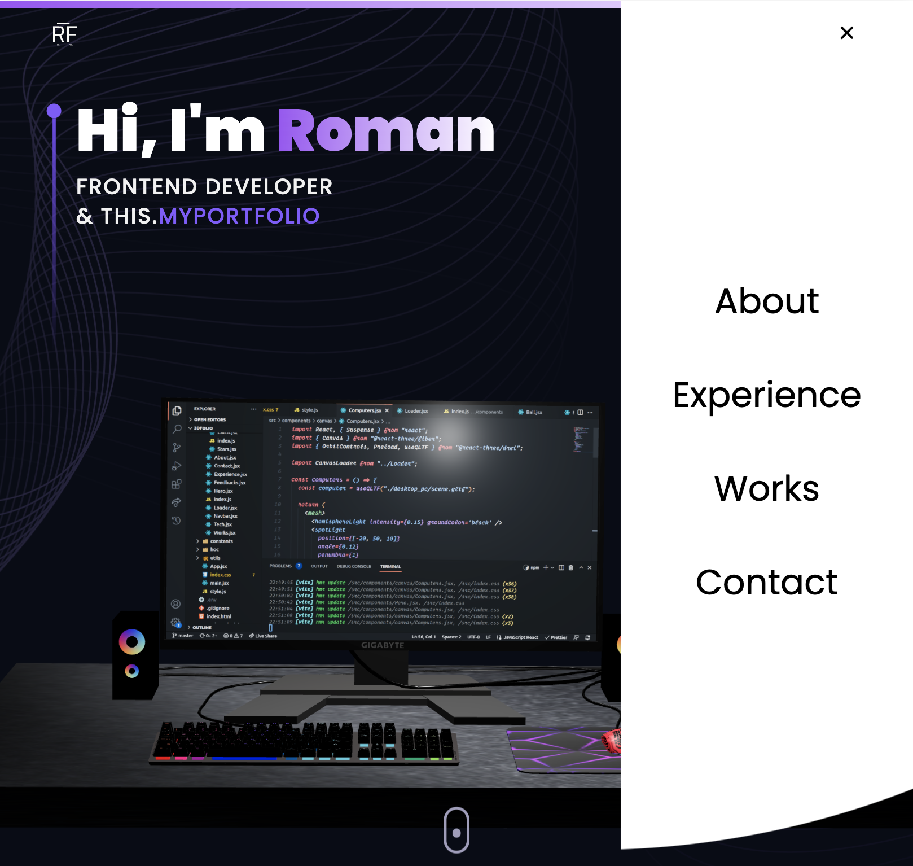

<h1 align='center' >My Porfolio 3D</h1>

 

<h2>Познакомьтесь с моим Портфолио v 2.0!</h2>

Внутри вы найдете информацию обо мне, а также ссылки на мои самые интересные проекты.

+ Для написания стилей используется библиотека[Taiwind CSS](https://tailwindui.com/?ref=top);
+ Для анимаций на странице используется библиотека [Framer Motion](https://www.framer.com/motion/);

